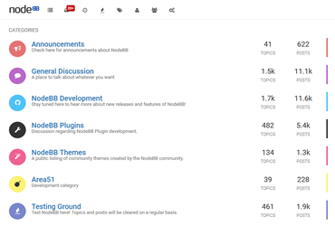

Persona theme for NodeBB
====================

The Persona theme is the default theme for NodeBB for versions spanning v0.7.1 through to v2.x

For the v3.x release line, Persona will be a supported theme bundled with NodeBB, but will not be active by default.

## Issues

Issues are now tracked in [the main project issue tracker](https://github.com/NodeBB/NodeBB/issues?q=is%3Aopen+is%3Aissue+label%3Athemes).

## Addons

[Recent Cards](https://github.com/psychobunny/nodebb-plugin-recent-cards)

## Screenshot

